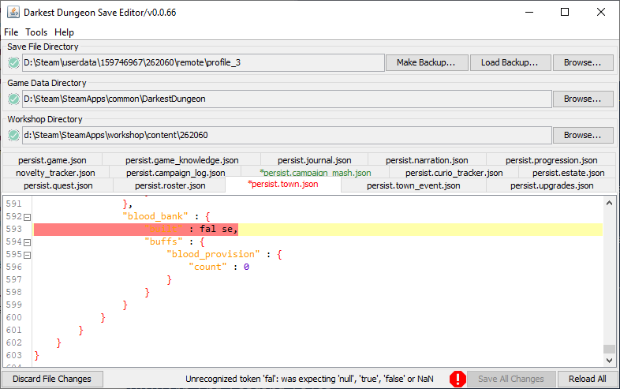

# Darkest Dungeon Save Editor

A Darkest Dungeon Save Game Reader, Editor and Writer. Requires Java Runtime Environment 8+.

*There also is an experimental [Rust](rust/ddsaveedit/) implementation with an online save editor.*

## [Download](https://github.com/robojumper/DarkestDungeonSaveEditor/releases/latest)

The link takes you to the latest release on the [Releases page](https://github.com/robojumper/DarkestDungeonSaveEditor/releases). You may also wish to build it yourself, see [Building](#building) for that.

## Motivation & Fundamentals

Darkest Dungeon uses a proprietary save fomat. The files have a `.json` extension, but are actually binary files.

While the general structure of the format resembles JSON, there are differences. A full documentation of the format can be found in [docs/dson.md](docs/dson.md).

## GUI

## Decoding

    java -jar DDSaveEditor.jar decode [--debug, -d] [--names, -n <namefile>] [--output, -o <outfile>] filename

`-d` dumps all metadata without known purpose as comments into the JSON file at the appropriate place.
This might come in handy when trying to find a pattern in them. With `-d`, the file is not valid JSON, but should be after removing all comments. Files translated without the `-d` flag should be valid JSON.
`-n` provides a Name File, a newline separated list of strings that are recognized as hashed values.

## Name Files

Darkest Dungeon hashes some strings using their own hash algorithm, which can make reading some files rather complicated for you. Whenever an integer is recognized as the hash of a given string, it's replaced with that String instead.
When combined with the `-d` flag, the hashed integers are added as comments.

A list can be compiled by running

    java -jar DDSaveEditor.jar names [dir1] [dir2] [dir3] [...]

`dir1`, ... are directories that contain Darkest Dungeon game data. These are usually the game root directory, but can also be mods.  
There is no output file parameter, just pipe it to a file (append `> names.txt`).

## Saving

There also is a save writer:

    java -jar DDSaveEditor.jar encode [--output, -o outfile] filename

The input file must be a save file decoded **without a name file** and **without the debug parameter**. Providing a name file changes the JSON structure and replaces some integers with strings, which breaks the game compatibility.

While the JSON exported by the decoder is valid JSON without any nonstandard extensions, the application still only de-/serializes Darkest Dungeon save files correctly. There are no guarantees that any additions that don't resemble the Darkest Dungeon data will serialize correctly.

## Spreadsheets

This application includes a service that uploads some save file data live to a Google Spreadsheet. In order to use this, you need to create a new Application using the [Google API Developer Console](https://console.developers.google.com/), enable the Google Sheets API and create an OAuth client ID and secret.

If you have done that, create a file `client_secret.json` with the following content in the same directory as the jar file:

    {
        "installed": {
            "client_id": "clientid",
            "client_secret": "clientsecret"
        }
    }

And launch it via

    java -jar DDSaveEditor.jar sheets [--names, -n <namefile>] [--sheet, -s <sheetid>] saveDir

or the GUI (`Tools->Spreadsheets`).

You will be asked whether to grant your application access to the spreadsheets. Confirm your choice and the data should start uploading.

## Building

The application uses Gradle to build. You can build a complete jar file using `./gradlew fatJar`. The jar file can be found as `build/libs/DDSaveEditor.jar`.

If you are using the spreadsheets service, you can add the `client_secret.json` to `src/main/resources` and build with `./gradlew fatJar -PincludeSecret`. This will include the id and secret in the jar file so you don't need to add a separate `client_secret.json` to the file system, just make sure you don't accidentally give this jar to anyone else as this would incur the risk of API Key abuse.

### Tests

In `src/tests`, there are a number of save files, some are mine, some are picked from other places on the internet. By running `./gradlew test`, a round trip-test is performed: the tests check if all of them can be loaded, and produce somewhat correct save files again.  
If the game updates, we'll probably need to update those save files too (I don't expect major changes to the format, but there might be the occasional new field that needs to be identified).

## Contributing

Contributions via Pull Requests or Issue reports welcome! For Pull Requests, please make sure that the round-trip tests pass and include your own save files as tests.

## Plans

* Figure out unknown variables
* Make a better GUI

## Attribution

* [Google GSON Library](https://github.com/google/gson) 2.8.5, licensed under the [Apache License 2.0](Licenses/Apachev2.0.txt).
* [Google API Client Libraries](https://github.com/google/google-api-java-client) 1.23.0, licensed under the [Apache License 2.0](Licenses/Apachev2.0.txt).
* [Jackson Core](https://github.com/FasterXML/jackson-core) 2.9.6, licensed under the [Apache License 2.0](Licenses/Apachev2.0.txt).
* [BuildConfig](https://github.com/mfuerstenau/gradle-buildconfig-plugin) 1.1.8, licensed under the [MIT License](Licenses/buildconfig_MIT.txt).
* [RSyntaxTextArea](https://github.com/bobbylight/RSyntaxTextArea) 3.0.3, licensed under the [Modified BSD License](Licenses/RSyntaxTextArea.License.txt).

## License

This application is licensed under the [MIT License](LICENSE).
